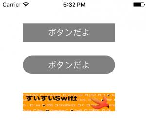

+++
title = "UIButton"
url = "2017-05-05"
date = "2017-05-05"
description = "UIButton"
tags = [
    "iOS",
]
categories = [
    "iOS",
]
archives = "2017/05"
aliases = ["migrate-from-jekyl"]
+++

 

The UIButton class is a class for placing a button.  
You can take an action with a button tap.  

Class Hierarchy of UIButton  

NSObject  
↑  
UIResponder  
↑  
UIView  
↑  
UIControl  
↑  
UIButton  
[AppleDeveloperリファレンスUIButton](https://developer.apple.com/documentation/uikit/uibutton)

UIButton example sentence

Here are some samples of various UIButtons

<!-- Google Ads -->


<!-- Amazon Ads -->



