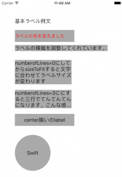

+++
title = "UILabel"
url = "2017-05-09"
date = "2017-05-09"
description = "UILabel"
tags = [
    "iOS",
]
categories = [
    "iOS",
]
archives = "2017/05"
aliases = ["migrate-from-jekyl"]
+++

 

The UILabel class is a class to manage the character display. This is used when you want to display text on the screen.

UILabel's class hierarchy

NSObject  
↑  
UIResponder  
↑  
UIView  
↑  
UILabel  

[AppleDeveloperリファレンス UILabel](https://developer.apple.com/documentation/uikit/uilabel)

UILabelサンプル

サンプルコード



UILabelのカスタマイズ

UILabelにタッチイベントを実装
参考: [[Swift2.0] UILabelとUIImageViewのタップイベント処理を実装する](https://qiita.com/k-yamada-github/items/79bb31cff50dc9fca321)

<!-- Google Ads -->


<!-- Amazon Ads -->



