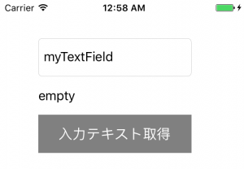

+++
title = "UITextField"
url = "2017-05-12"
date = "2017-05-12"
description = "UITextField"
tags = [
    "iOS",
]
categories = [
    "iOS",
]
archives = "2017/05"
aliases = ["migrate-from-jekyl"]
+++

 

A UITextField is used to enter a character.

Class Hierarchy of UITextField

NSObject  
↑upside down  
UIResponder.  
↑upside down  
UIView.  
↑upside down  
UIControl  
↑upside down  
UITextField  
AppleDeveloper Reference UITextField  

UITextField Example Sentence

UITextField, generate and, when the button is pressed, take a string from the UITextField and copy it to a label.

<!-- Google Ads -->


<!-- Amazon Ads -->



