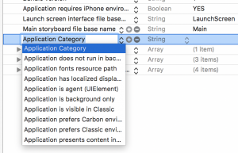

+++
title = "Speech Recognition(SFSpeechRecognizer)"
url = "2017-05-13"
date = "2017-05-13"
description = "Speech Recognition(SFSpeechRecognizer)"
tags = [
    "iOS",
]
categories = [
    "iOS",
]
archives = "2017/05"
aliases = ["migrate-from-jekyl"]
+++

 

iOS10からSpeech Frameworkが登場しました。  
ここではSFSpeechRecognizerを使って音声認識をしてみようと思います。  
そしてシミュレーターでは動かないから気をつけてください。  

参考: [AppleDeveloper:SpeakToMe: Using Speech Recognition with AVAudioEngine](https://developer.apple.com/library/archive/samplecode/SpeakToMe/Introduction/Intro.html)  
参考: [あたも開発ブログ](http://atamo-dev.hatenablog.com/entry/2016/07/20/200650)  
参考: [【iOS 10】Speechフレームワークで音声認識 – 対応言語リスト付き](http://shu223.hatenablog.com/entry/20160615/1466036672)

プライバシー設定をinfo.plistに記入

iOS10になってから、プライバシーに関する機能(通知、カメラ、フォトライブラリへのアクセス)を使う際に、Info.plistにあらかじめ使うことを書いておかないとアプリが落ちてしまうようになりました。  
音声認識機能を使う場合は以下のプライバシー設定を行う必要があります。  

参考: [アプリ開発ブログ（仮）](http://galakutaapp.blogspot.com/2016/09/plist.html)

info.plistを開き、Privacy – Speech Recognition Usage DescriptionをStringで追加し、右側に使用目的を記入します。  
Privacy – Microphone Usage Description to practice programingもまたStringで追加し、右側に使用目的を記入します。  
使用目的が書かれていないと審査で落とされるらしいです。  

サンプルコード

音声認識の結果をAlertで表示するプログラムです。

<!-- Google Ads -->


<!-- Amazon Ads -->



