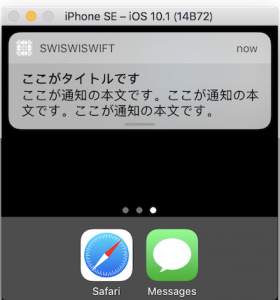

+++
title = "UserNotification(LocalNotification)"
url = "2017-05-14"
date = "2017-05-14"
description = "UserNotification(LocalNotification)"
tags = [
    "iOS",
]
categories = [
    "iOS",
]
archives = "2017/05"
aliases = ["migrate-from-jekyl"]
+++

 

UserNotification is used to issue a notification to a user.  
There are two main types of UserNotifications, RemoteNotification (notifications like Line and Twitter) and LocalNotification (notifications that are issued internally, like clock apps).  
This section deals with LocalNotification.  

UserNotification sample  

First of all, the sound data (.caf file) to be used for issuing the original notification sound is registered in the project.  
Add the `.caf` file to your project and make sure that it is registered with BundleResouces.  
Here's the CAF file I also used.  
As a specification of UserNotification, if the original notification sound used is defective, the default notification sound will be played back.  

<!-- Google Ads -->


<!-- Amazon Ads -->



