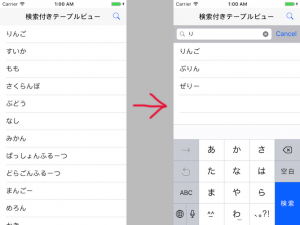

+++
title = "UITableView and UISearchBar"
url = "2017-05-15"
date = "2017-05-15"
description = "UITableView and UISearchBar"
tags = [
    "iOS",
]
categories = [
    "iOS",
]
archives = "2017/05"
aliases = ["migrate-from-jekyl"]
+++

 

This is a sample of the combination of UITableView and UISearchBar.  
Pressing the magnifying glass on the navigation bar will bring up the SearchBar, and typing a character there will bring up the search results.  

UITableView  

The following is an example sentence for a basic table view.   

<!-- Google Ads -->


<!-- Amazon Ads -->



