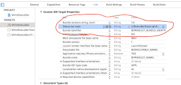

+++
title = "Whitening the UIStatusBar"
url = "2017-05-16"
date = "2017-05-16"
description = "Whitening the UIStatusBar"
tags = [
    "iOS",
]
categories = [
    "iOS",
]
archives = "2017/05"
aliases = ["migrate-from-jekyl"]
+++

 
Here's how to whiten the UIStatusBar.  

How to make UIStatusBar white, part 1  

How to make UIStatusBar white, part 1. This is how to whiten a particular ViewController. Write it to the UIViewController that you want to make white.  
Please note that the StatusBar under the NavigationController will not become white in this way.  

How to make UIStatusBar white, part 2

Here's how to make all StatusBar white.  
Add [Status bar style], [UIStatusBarStyleLightContent], [View controller-based status bar appearance], and [NO] to the project's target info. StatusBar under NavigationController also becomes white.  
 The background color of the View is orange to make it easier to understand.  

 
 

 <!-- Google Ads -->
 

 <!-- Amazon Ads -->
 


