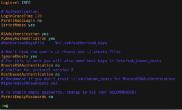

+++
title = "Disable root login"
url = "2017-06-08"
date = "2017-06-08"
description = "Disable root login"
tags = [
    "Linux",
]
categories = [
    "Linux",
]
archives = "2017/06"
aliases = ["migrate-from-jekyl"]
+++

<br>

Here's a note to ban root login, which is the first thing you do after renting a VPS.  

Log in to the server as root and enter your password.  


```
$ ssh -l root xxx.xxx.xxx.xxx
```

Add a user, named onojun.    

```
$ adduser onojun
```

Set the password, depending on the OS, it should be set when you use adduser.  

```
$ passwd onojun
```

Log out once.

```
$ exit
```

Check if you can log in with the onojun you created, you can use SSH login command as you like.  


```
$ ssh onojun@xxx.xxx.xxx.xxx
```

Once you are logged in, switch to root.  

```
$ su -
```

Edit the ssh configuration file. I'll make a backup for you too.  

```
$ cd /etc/ssh
$ cp sshd_config sshd_config.old
```

Edit the configuration file in vim and set it to PermitRootLogin no.  

```
$ vim sshd_config
```

It's at about line 40.  

```
PermitRootLogin no
```



Restarting sssh  

```
$ service sshd restart
```

If I can't log in as root, I'm done!

<!-- Google Ads -->


<!-- Amazon Ads -->

