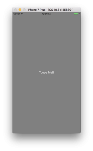
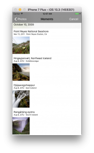

+++
title = "Selecting images with UIImagePickerController"
url = "2017-06-14"
date = "2017-06-14"
description = "Selecting images with UIImagePickerController"
tags = [
    "iOS",
]
categories = [
    "iOS",
]
archives = "2017/06"
aliases = ["migrate-from-jekyl"]
+++

 

It is a sample program to get an image from the photo library of the iPhone.  

In order to select images from the photo library, you have to specify that the photo library is used in the `info.plist` file of the project.  
If you don't write this, UIImagePickerController won't work.  
Use the following values for the key  
`NSPHOtoLibraryUsageDescription`.  
Type is `String` and the reason for its use is written in the Value.  
I've heard that if you don't write the reason for using it, it will be rejected at the time of examination.  
It looks like the image below.  

The code looks like this

<!-- Google Ads -->


<!-- Amazon Ads -->



