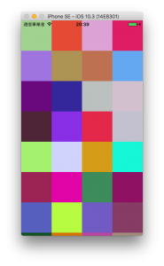

+++
title = "UICollectionView"
url = "2017-10-02"
date = "2017-10-02"
description = "UICollectionView"
tags = [
    "iOS",
]
categories = [
    "iOS",
]
archives = "2017/10"
aliases = ["migrate-from-jekyl"]
+++

 

This is a sample of UICollectionView.  

This is a reference to the  
This site is easy to look at and I highly recommend it to anyone who does SWIFT.  

The `makeColor()` function fills a cell with randomly generated colors.  
Each time you scroll, the color changes.  

Reference:
[UICollectionViewを使う](http://docs.fabo.io/swift/uikit/053_uicollectionview.html)

<!-- Google Ads -->


<!-- Amazon Ads -->



