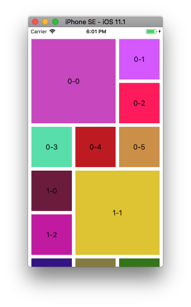

+++
title = "Create a collection view with custom layouts"
url = "2017-11-27"
date = "2017-11-27"
description = "Create a collection view with custom layouts"
tags = [
    "iOS",
]
categories = [
    "iOS",
]
archives = "2017/11"
aliases = ["migrate-from-jekyl"]
+++

 

I decided to create a design with nested images in the app I'm working on, so I looked into how to implement it.  

I used the following site as a reference for the main code.  
Thank you very much.  
The Swift2->4 conversion was a pain.  

[iOS UICollecionViewFlowLayout でカスタムレイアウトを作ろう ～ Swift版](https://www.indetail.co.jp/blog/5257/)

<!-- Google Ads -->


<!-- Amazon Ads -->



