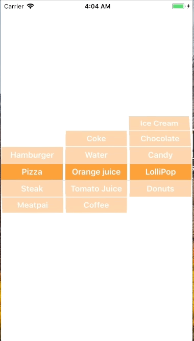

+++
title = "Selecting values using the UIPickerView"
url = "2018-01-14"
date = "2018-01-14"
description = "Selecting values using the UIPickerView"
tags = [
    "iOS",
]
categories = [
    "iOS",
]
archives = "2018/01"
aliases = ["migrate-from-jekyl"]
+++

 

Hi there!  
This is the sample code for retrieving the value using UIPickerView.  
PIPickerView is often used to select elements from a selection.  
This time, I created an app that allows you to choose between food, drink and food.  

AppleDeveloperDocuments  
[UIPickerView](https://developer.apple.com/documentation/uikit/uipickerview)

<!-- Google Ads -->


<!-- Amazon Ads -->



