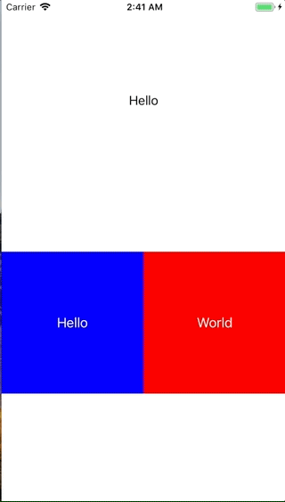

+++
title = "Using UserDefaults to save parameters"
url = "2018-01-17"
date = "2018-01-17"
description = "Using UserDefaults to save parameters"
tags = [
    "iOS",
]
categories = [
    "iOS",
]
archives = "2018/01"
aliases = ["migrate-from-jekyl"]
+++

 

UserDefaults are used to store data that you want to keep even if you drop the app.  
It's very simple to use.  
In the sample code, the initial value is set with `userDefaults.register(defaults: ["KEY_LabelText": "Hello"]]` at first.  
The `.register ()` is very useful and puts the initial value when there is no data corresponding to the specified key.  
Then the label reads the value saved by UserDefault and reflects it in the text of the label.  
And when the button is pressed, it updates the value of the userdefaults and label.  

<!-- Google Ads -->


<!-- Amazon Ads -->



