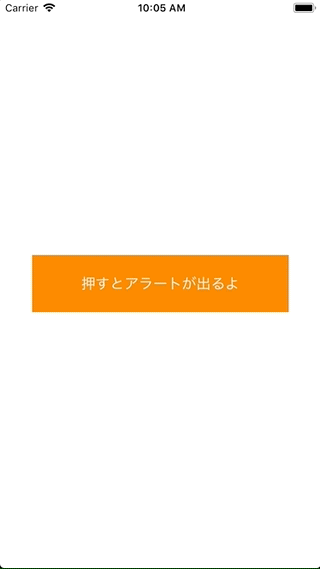

+++
title = "UIAlertController(UIActionSheet)"
url = "2018-03-05"
date = "2018-03-05"
description = "UIAlertController(UIActionSheet)"
tags = [
    "iOS",
]
categories = [
    "iOS",
]
archives = "2018/03"
aliases = ["migrate-from-jekyl"]
+++

 

The alerts that come out from below are implemented using UIAlertController.  
A long time ago, there was a time when alerts coming out of the bottom were called UIActionSheets, but they have been integrated into UIAlertController.

<!-- Google Ads -->


<!-- Amazon Ads -->



