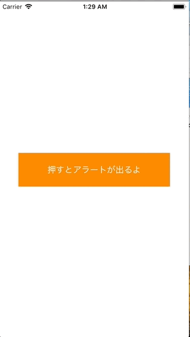

+++
title = "Display an alert with UIAlertController"
url = "2018-03-06"
date = "2018-03-06"
description = "Display an alert with UIAlertController"
tags = [
    "iOS",
]
categories = [
    "iOS",
]
archives = "2018/03"
aliases = ["migrate-from-jekyl"]
+++

 

Here is a sample of how to issue alerts using UIAlertController.  
If you set `UIAlertControllerStyle.alert` to `UIAlertControllerStyle.actionSheet`, it will be an alert that comes out from the bottom.  

<!-- Google Ads -->


<!-- Amazon Ads -->



