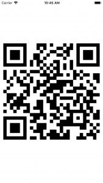

+++
title = "Generating a QR code from a string or URL"
url = "2018-03-07"
date = "2018-03-07"
description = "Generating a QR code from a string or URL"
tags = [
    "iOS",
]
categories = [
    "iOS",
]
archives = "2018/03"
aliases = ["migrate-from-jekyl"]
+++

 

This is a sample code to generate a QR code from a character string or URL.  

Reference:
[CIImageをData型に変換したときにハマった時の対処法(Swift3.0)](https://qiita.com/coffeemk2/items/5f6f5352f9b8b1b02ec9)  
[SwiftでQRコードを生成してみた](https://qiita.com/matsuhisa_h/items/91cdeeaf32553c3b23fb)

The generated QR code is here.    

<!-- Google Ads -->


<!-- Amazon Ads -->



