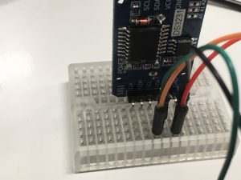
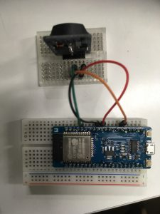

+++
title = "Using the RTC module with ESP32"
url = "2018-03-14"
date = "2018-03-14"
description = "Using the RTC module with ESP32"
tags = [
    "ESP32",
]
categories = [
    "ESP32",
]
archives = "2018/03"
aliases = ["migrate-from-jekyl"]
+++

 

I tried to use the RTC module with ESP32 and got a little stuck, so I wrote about it.
To conclude, I solved the problem by bringing #include DS1307RTC.h to the top.
This is the ESP32 version of the ReadTest sample code.

The libraries and equipment used are as follows.

DS1307RTC library
[github.com/PaulStoffregen/DS1307RTC](https://github.com/PaulStoffregen/DS1307RTC)

[ESPr® Developer 32 ](https://amzn.to/2u4PvEn)

[HiLetgo 3個セット DS3231 AT24C32 時計モジュール リアル時間時計モジュール IICモジュール RTCモジュール Arduinoに対応 並行輸入品](https://amzn.to/39qbi9R)

wiring diagram  

<!-- Google Ads -->


<!-- Amazon Ads -->



