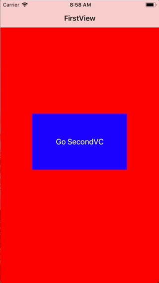

+++
title = "Implementing NavigationController"
url = "2018-03-15"
date = "2018-03-15"
description = "Implementing NavigationController"
tags = [
    "iOS",
]
categories = [
    "iOS",
]
archives = "2018/03"
aliases = ["migrate-from-jekyl"]
+++

 

This is the sample code for the NavigationContoroller.  
The NavigationContoroller moves sideways to make screen transitions.   

<!-- Google Ads -->


<!-- Amazon Ads -->



