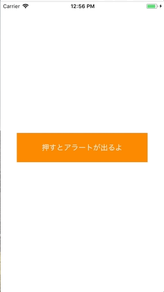

+++
title = "Adding a TextField to UIAlertController"
url = "2018-03-17"
date = "2018-03-17"
description = "Adding a TextField to UIAlertController"
tags = [
    "iOS",
]
categories = [
    "iOS",
]
archives = "2018/03"
aliases = ["migrate-from-jekyl"]
+++

 

This is a sample of adding a TextField to UIAlertController.    

<!-- Google Ads -->


<!-- Amazon Ads -->



