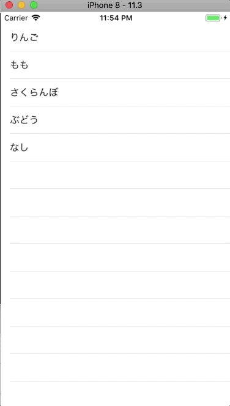

+++
title = "Edit TableView and delete a Cell (side-slide)."
url = "2018-04-23"
date = "2018-04-23"
description = "Edit TableView and delete a Cell (side-slide)."
tags = [
    "iOS",
]
categories = [
    "iOS",
]
archives = "2018/04"
aliases = ["migrate-from-jekyl"]
+++

<br>

This is a sample code to delete a Cell by editing TableView.  
By adding the following functions, you can add the ability to delete a cell by sliding it horizontally.  

```
func tableView(_ tableView: UITableView, commit editingStyle: UITableViewCellEditingStyle, forRowAt indexPath: IndexPath)
```



<!-- Google Ads -->


<!-- Amazon Ads -->



