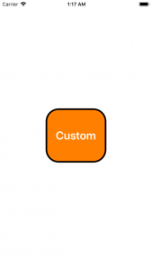

+++
title = "Implementing a custom button class"
url = "2018-05-02"
date = "2018-05-02"
description = "Implementing a custom button class"
tags = [
    "iOS",
]
categories = [
    "iOS",
]
archives = "2018/05"
aliases = ["migrate-from-jekyl"]
+++

 

This is a sample code to create and paste a custom button class that extends UIButton.  
By separating the look and feel of the ViewController into separate files, you can make the ViewController look neat.  

<!-- Google Ads -->


<!-- Amazon Ads -->



