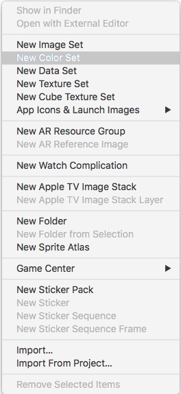
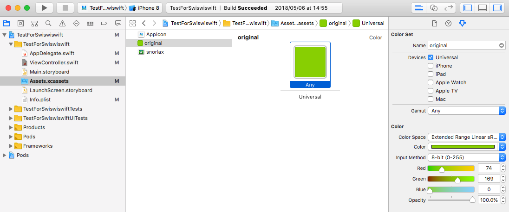
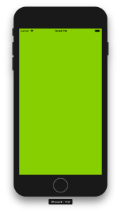

+++
title = "Using Color Set to manage colors in Asset Catalog"
url = "2018-05-24"
date = "2018-05-24"
description = "Using Color Set to manage colors in Asset Catalog"
tags = [
    "iOS",
]
categories = [
    "iOS",
]
archives = "2018/05"
aliases = ["migrate-from-jekyl"]
+++

 

Starting with Xcode9 (iOS 11), you can now manage your colors with Assets.  
I made a UIColor Extension and registered a color and made a function.  
It's easier to manage the colors, and I think it's easier to work with the designers. I thought to myself.  
It's a very good feature, but it only works on iOS 11 and above, so you need to be careful.  
If you don't set Deployment Target to 11.0 or higher, you will get a warning.  

Open Asset and right click -> Select "New Color Set".  

Here we register a dark green with the name "ORIGINAL    

<!-- Google Ads -->


<!-- Amazon Ads -->



