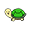
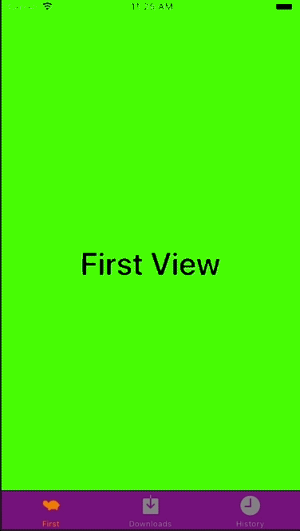

+++
title = "Implement UITabBarController."
url = "2018-06-02"
date = "2018-06-02"
description = "Implement UITabBarController."
tags = [
    "iOS",
]
categories = [
    "iOS",
]
archives = "2018/06"
aliases = ["migrate-from-jekyl"]
+++

 

This is a sample implementation of UITabBarController, which is used to switch views.  
The icon for UITabBarController is a 30×30 transparent png.   

 

<!-- Google Ads -->


<!-- Amazon Ads -->



