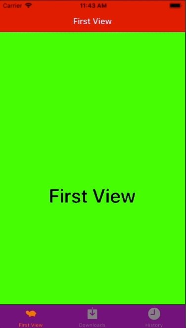

+++
title = "Nested implementation of UINavigationController in UITabBarController."
url = "2018-06-03"
date = "2018-06-03"
description = "Nested implementation of UINavigationController in UITabBarController."
tags = [
  "iOS",
]
categories = [
  "iOS",
]
archives = "2018/06"
aliases = ["migrate-from-jekyl"]
+++

 

This is the code to add UINavigationController to UITabBarController.
Implemented by including UINavigationBarController in UITabBarController.

The implementation of UITabBarController is here.
Implementing NavigationController

<!-- Google Ads -->


<!-- Amazon Ads -->



