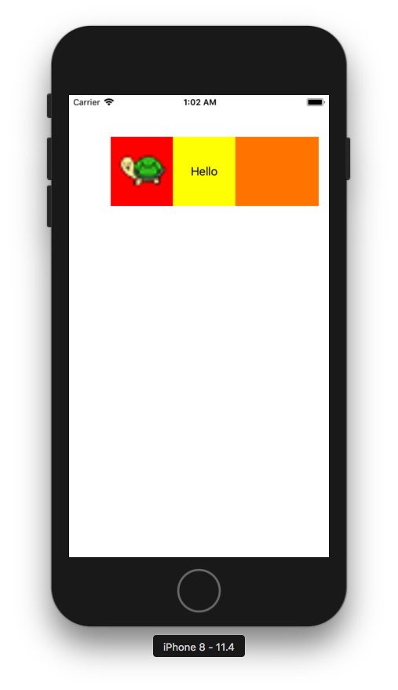

+++
title = "Implementing CustomView with Code"
url = "2018-06-19"
date = "2018-06-19"
description = "Implementing CustomView with Code"
tags = [
  "iOS",
]
categories = [
  "iOS",
]
archives = "2018/06"
aliases = ["migrate-from-jekyl"]
+++

 

Here's a sample of how to create and display a custom view in your code.  
I like to implement it without using xib or storyborad, but what's best? 

<!-- Google Ads -->


<!-- Amazon Ads -->



