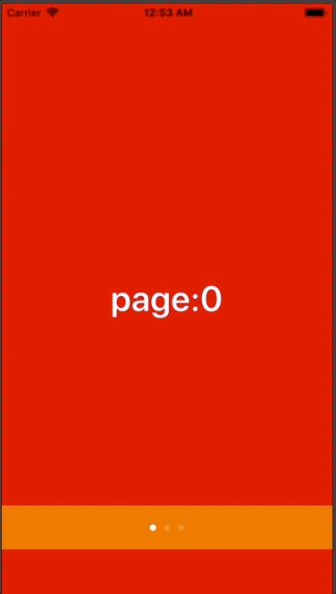

+++
title = "PageViewController & PageControl"
url = "2018-06-21"
date = "2018-06-21"
description = "PageViewController & PageControl"
tags = [
    "iOS",
]
categories = [
    "iOS",
]
archives = "2018/06"
aliases = ["migrate-from-jekyl"]
+++

 

This is an implementation sample of PageViewController, which is often used for tutorial screens and e-book readers.

<!-- Google Ads -->


<!-- Amazon Ads -->



