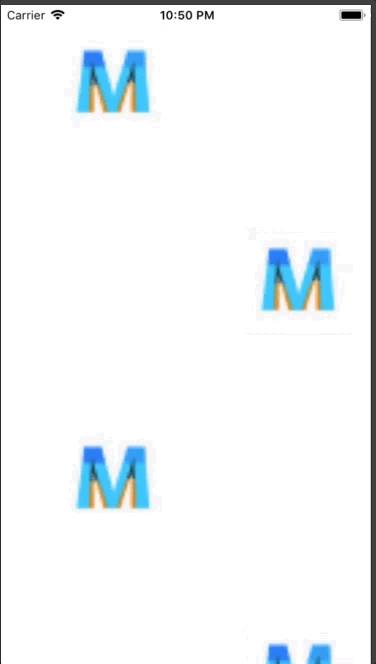

+++
title = "Implementing a flowing background"
url = "2018-06-28"
date = "2018-06-28"
description = "Implementing a flowing background"
tags = [
    "iOS",
]
categories = [
    "iOS",
]
archives = "2018/06"
aliases = ["migrate-from-jekyl"]
+++

 

I'm sometimes asked how to implement the background of an app I'm making called Four Choice Chemistry, so I wrote a sample code for it.  
The icon image of the app flows through the background of the View.  
Also, if you write animation-related methods in viewDidLoad, animations may stop due to navigation bar transitions.  
In this case, writing the animation-related methods to viewWillAppear solves the problem.  

<!-- Google Ads -->


<!-- Amazon Ads -->



