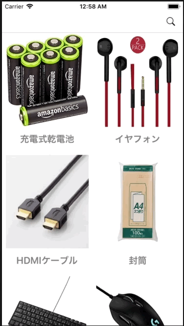

+++
title = "Search with SearchBar in CollectionView"
url = "2018-07-18"
date = "2018-07-18"
description = "Search with SearchBar in CollectionView"
tags = [
    "iOS",
]
categories = [
    "iOS",
]
archives = "2018/07"
aliases = ["migrate-from-jekyl"]
+++

 

This is a sample of a search with a search bar and a collection view in the collection view.

<!-- Google Ads -->


<!-- Amazon Ads -->



