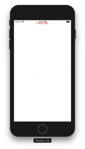
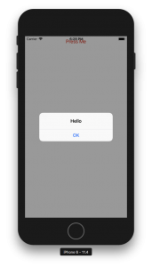

+++
title = "Display the button with ReactNative"
url = "2018-08-12"
date = "2018-08-12"
description = "Display the button with ReactNative"
tags = [
    "ReactNative",
]
categories = [
    "ReactNative",
]
archives = "2018/08"
aliases = ["migrate-from-jekyl"]
+++

 

This is a sample of displaying a button in ReactNative.  
Press the button to display the alarm.

react-native: 0.56.0  

<!-- Google Ads -->


<!-- Amazon Ads -->



