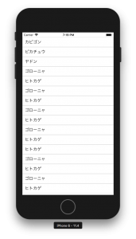

+++
title = "Displaying a FlatList in ReactNative"
url = "2018-08-13"
date = "2018-08-13"
description = "Displaying a FlatList in ReactNative"
tags = [
    "ReactNative",
]
categories = [
    "ReactNative",
]
archives = "2018/08"
aliases = ["migrate-from-jekyl"]
+++

 

This is a sample to display FlatList in ReactNative.    

react-native: 0.56.0

<!-- Google Ads -->


<!-- Amazon Ads -->



