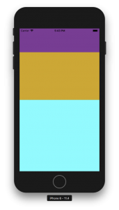
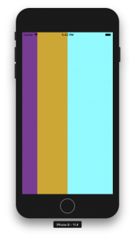

+++
title = "Specifying the size of the View in FlexBox"
url = "2018-08-14"
date = "2018-08-14"
description = "Specifying the size of the View in FlexBox"
tags = [
    "ReactNative",
]
categories = [
  "ReactNative",
]
archives = "2018/08"
aliases = ["migrate-from-jekyl"]
+++

 

This is a sample code to specify the size of the View with FlexBox.

react-native: 0.56.0

The purple, ochre, and light blue views are at a height of 1 : 2 : 3.



To make it horizontal, set flexDirection: 'row'.

<!-- Google Ads -->


<!-- Amazon Ads -->



