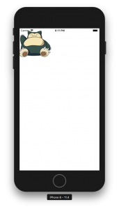

+++
title = "Display an image with ReactNative"
url = "2018-08-15"
date = "2018-08-15"
description = "Display an image with ReactNative"
tags = [
    "ReactNative",
]
categories = [
    "ReactNative",
]
archives = "2018/08"
aliases = ["migrate-from-jekyl"]
+++

 

This is a sample of displaying an image with ReactNative.  
If you want to retrieve images from the Internet on iOS, you need to set up ATS, so be careful.  

react-native: 0.56.0

<!-- Google Ads -->


<!-- Amazon Ads -->



