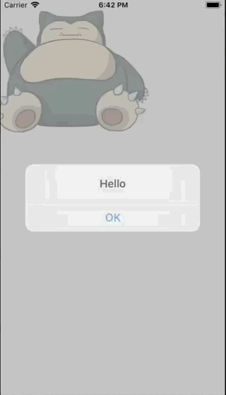

+++
title = "Turning an image into a button with ReactNative(TouchableOpacity)"
url = "2018-08-19"
date = "2018-08-19"
description = "Turning an image into a button with ReactNative(TouchableOpacity)"
tags = [
    "ReactNative",
]
categories = [
    "ReactNative",
]
archives = "2018/08"
aliases = ["migrate-from-jekyl"]
+++

 

This is a sample implementation of TouchableOpacity, which turns a view such as an image into a button in ReactNative.  
Tap on an image of Kabigon to get an alert.  

react-native: 0.56.0  

<!-- Google Ads -->


<!-- Amazon Ads -->



