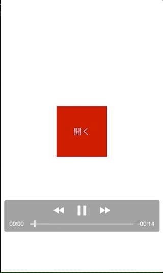

+++
title = "Read barcodes in iOS"
url = "2018-09-17"
date = "2018-09-17"
description = "Read barcodes in iOS"
tags = [
    "iOS",
]
categories = [
    "iOS",
]
archives = "2018/08"
aliases = ["migrate-from-jekyl"]
+++

 

This is a sample code to read barcodes with Swift.

Reference:
[Swift 4でQRコードを読み取る](https://shinjism.com/blog/2017/10/qrcode.html)  
[AVFoundation(AVCaptureMetadataOutput)でバーコードリーダーを作ってみた](https://dev.classmethod.jp/smartphone/ios-avfoundation-avcapturemetadataoutput-ean13-ean8/)  

First of all, the `info.plist` contains the
Add a key of `Privacy - Camera Usage Description` to describe the reason for using the camera.
"Barcode reader reads" and so on.
This phrase appears when you ask for permission to use it.

<!-- Google Ads -->


<!-- Amazon Ads -->



