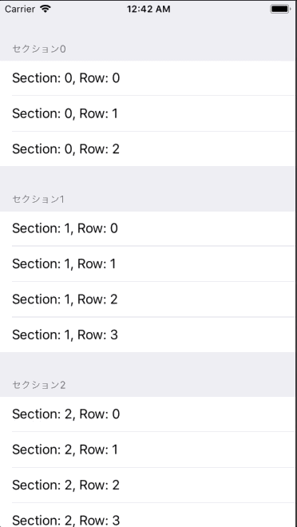

+++
title = "Creating a Group Style TableView"
url = "2018-09-20"
date = "2018-09-20"
description = "Creating a Group Style TableView"
tags = [
    "iOS",
]
categories = [
    "iOS",
]
archives = "2018/09"
aliases = ["migrate-from-jekyl"]
+++

 

Sample code to display the group style table view.
The settings screen looks like this.

<!-- Google Ads -->


<!-- Amazon Ads -->



