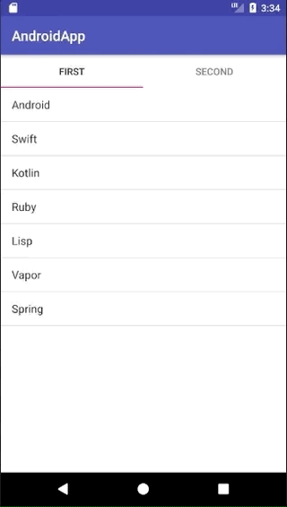

+++
title = "Creating a Tab with ListView in Kotlin"
url = "2018-09-25"
date = "2018-09-25"
description = "Creating a Tab with ListView in Kotlin"
tags = [
    "Android",
]

categories = [
    "Android",
]
archives = "2018/09"
aliases = ["migrate-from-jekyl"]
+++

 

I created a Tab that contains a ListView in Kotlin.

This is the web page I used as a reference.
It's a very good article, so please see his article from this one.

[Getting Started with Tabs in Android — Kotlin](https://medium.com/@eijaz/getting-started-with-tablayout-in-android-kotlin-bb7e21783761)

Add the following dependency to build.gradle

`implementation 'com.android.support:design:26.1.0'`

<!-- Google Ads -->


<!-- Amazon Ads -->



