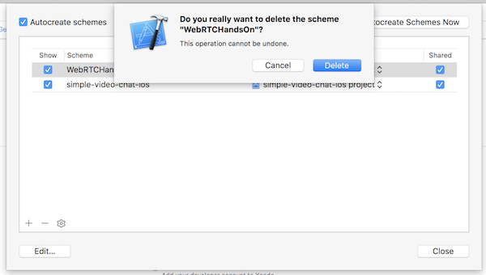
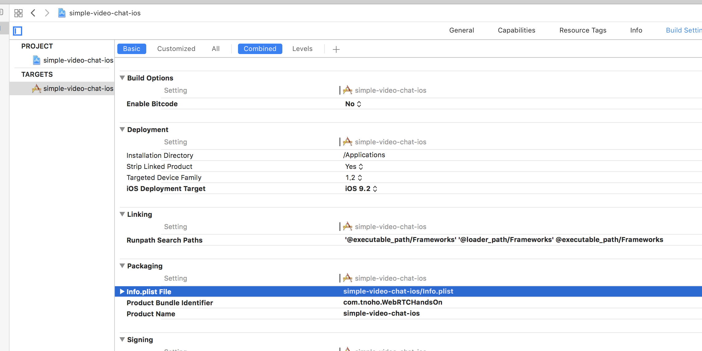

+++
title = "Renaming a project in Xcode10"
url = "2018-11-12"
date = "2018-11-12"
description = "Renaming a project in Xcode10"
tags = [
    "iOS",
]
categories = [
    "iOS",
]
archives = "2018/11"
aliases = ["migrate-from-jekyl"]
+++

 

I referred to this article as a reference.  
Thank you so much!  
The reference article is more detailed, so if you have any questions, please check it out.  

[Xcodeでプロジェクト名を変更する方法 (Xcode8.0)](https://tech.librastudio.co.jp/index.php/2016/10/05/post-1038/)

In this case, I've renamed the project WebRTCHandsOn to simple-video-chat-ios.

1.Renaming a project from Xcode
You can see the details in the right pane, so change the Name of "Identity and Type" to a new project name (in this case, simple-video-chat-ios).

When you get a confirmation and an alert, press the rename button to rename.

2.Change of Scheme
Select [Product] -> [Scheme] -> [Manage Schemes] from the menu at the top of the screen.  
When an alert appears, select the "+" button at the bottom left to add a new target (the target after the rename).  

After adding the new target, delete the old target and close it.

3.Modification of Podfile  
If you're using CocoaPods, the pod file also needs to be modified.  
Enter a new project name in the target field.  

When you're done modifying the podfile, delete the pod directory and run pod install again.  
Remove the .workplace file of the previous project name because it is not needed.  

When you're done modifying the podfile, delete the pod directory and run pod install again.  
Remove the .workplace file of the previous project name because it is not needed.  

Build in this state and make sure that no errors appear.  

5. Modify the directory name.  
Finally, manually modify the directory name to the new name.  
If you modify the directory name, Xcode won't recognize it, so register a new directory with Identity and Type.  

Also, the destination of info.plist is wrong, so fix it.  

And you're done!  

Jun 20, 2019 Postscript.  
When renaming, UnitTest and UITest can no longer be run.  
I deleted Target once and rebuilt it, and it worked fine.  

<!-- Google Ads -->


<!-- Amazon Ads -->

