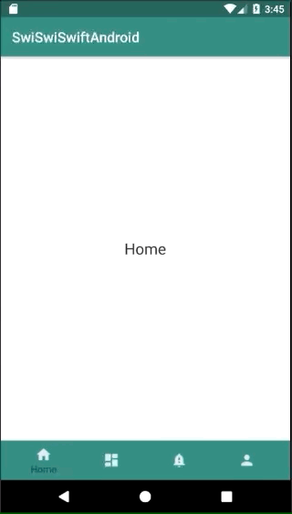

+++
title = "Implementing BottomNavigation with nested Fragments."
url = "2018-11-13"
date = "2018-11-13"
description = "Implementing BottomNavigation with nested Fragments."
tags = [
    "Android",
]
categories = [
    "Android",
]
archives = "2018/11"
aliases = ["migrate-from-jekyl"]
+++

 

BottomNavigation is an API similar to iOS's TabBarController.  
This is a sample code that switches Fragment when selecting a tab in BottomNavigation.  

The page I used as a reference.   
[BottomNavigationView入門](https://qiita.com/neonankiti/items/8f5a4b9039914192a948)  
[Bottom Navigation Android Example using Fragments](https://www.simplifiedcoding.net/bottom-navigation-android-example/)  

<!-- Google Ads -->


<!-- Amazon Ads -->



