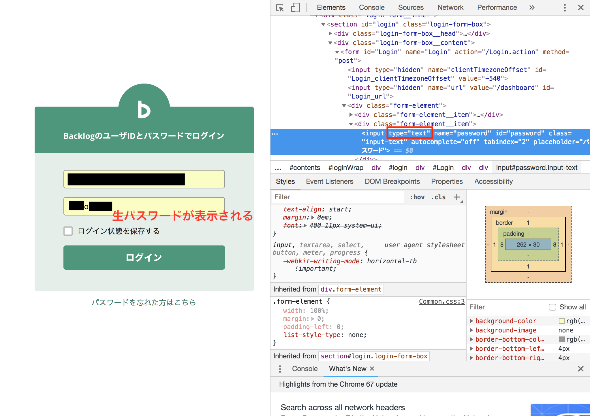

+++
title = "I want to see what's in the password field."
url = "2018-11-14"
date = "2018-11-14"
description = "I want to see what's in the password field."
tags = [
    "Other",
]
categories = [
    "Other",
]
archives = "2018/11"
aliases = ["migrate-from-jekyl"]
+++

 

The method to confirm the contents of the black circle●●●● in the password input column of the login screen.  
element and validation, and change the type of the input tag to text.  

<!-- Google Ads -->


<!-- Amazon Ads -->

