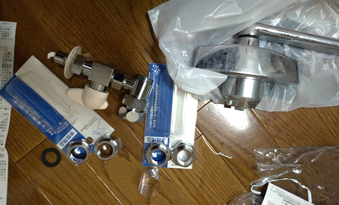
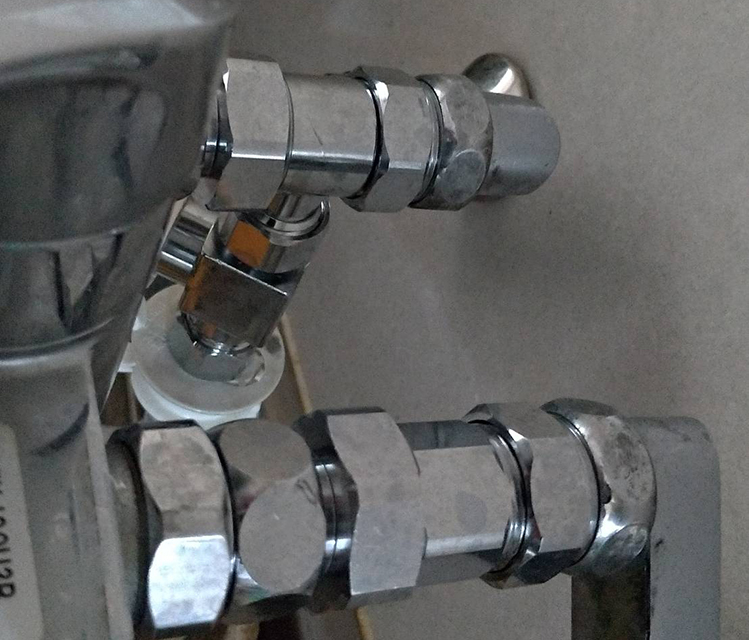

+++
title = "Do it yourself to install a branch faucet for a dishwasher"
url = "2018-12-24"
date = "2018-12-24"
description = "Do it yourself to install a branch faucet for a dishwasher"
tags = [
  "Other",
]
categories = [
    "Other",
]
archives = "2018/12"
aliases = ["migrate-from-jekyl"]
+++

 

I bought a dishwasher at Bic Camera with the cash back campaign.
[パナソニック 食器洗い機（ホワイト）【食洗機】 Panasonic プチ食洗 NP-TCB4-W](https://amzn.to/2ZzdVkU)

I was told that the installation work of the branch faucet of the dishwasher would cost 15,000 yen (construction 5,000 yen + branch faucet 10,000 yen), so let's do it by myself! So I did it myself.

Buy a branch faucet and a monkey wrench that can accommodate a variety of nut sizes.  
Two monkey wrenches are required for branch faucet work. (to hold down the nut + turn the screw)

[SANEI 【食器洗い機用分岐ソケット】混合栓本体と偏心管の間に取り付けて分岐するタイプ PB515S ](https://amzn.to/36a4POa)

The faucet in my condo is made by TOTO, and because the size of the nut is different, a branch faucet (PB515S) could not be attached, so I also purchased the following adapter.  
Check the size of the faucet and the size of the branch faucet, and if you need an adapter, rush to the home improvement center with the branch faucet and faucet and buy one.

[SANEI 偏心管アダプター PT243S](https://amzn.to/2SExo2c)

[SANEI 偏心管アダプター PT242S](https://amzn.to/2F7wxPQ)

Once the materials and tools are in place, we can start construction immediately. Turn off the water main and remove the faucet.  
Be careful not to turn off the faucet without turning off the main tap, as it can be a catastrophe.

After removing the faucet, make sure it is the right size for the branch faucet or adapter.  
If it's not the right size at this stage, I'll put the faucet back on, but rush to the home improvement center.

Connect the branch faucet, faucet and adapter and you're done.
If the connection is too loose, water will blow out, in which case, turn off the main tap immediately.

