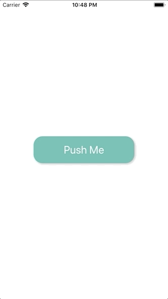

+++
title = "The interaction of the Lifesum app was nice, so I tried to recreate it."
url = "2018-12-28"
date = "2018-12-28"
description = "The interaction of the Lifesum app was nice, so I tried to recreate it."
tags = [
  "iOS",
]
categories = [
    "iOS",
]
archives = "2018/12"
aliases = ["migrate-from-jekyl"]
+++

 

#Swift4.2  

I tried to recreate the interaction of the registration guide of the app Lifesum because it was very nice.  
I'm curious about the correlation between the awesomeness of the interaction and the registration dropout rate.  

<!-- Google Ads -->


<!-- Amazon Ads -->



