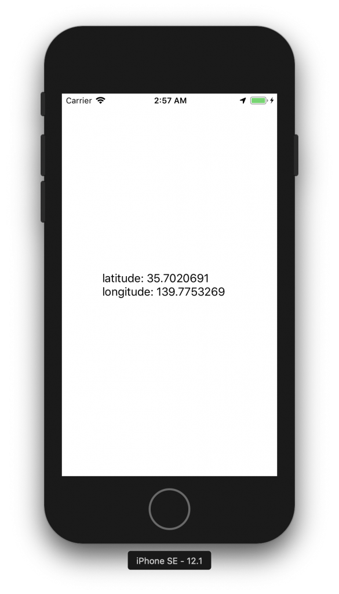

+++
title = "Obtaining location information while using the app"
url = "2018-12-29"
date = "2018-12-29"
description = "Obtaining location information while using the app"
tags = [
  "iOS",
]
categories = [
    "iOS",
]
archives = "2019/01"
aliases = ["migrate-from-jekyl"]
+++

 

#Swift 4.2

This is a sample code to get the latitude and longitude while using the app.  
The label string is updated when the latitude and longitude of the terminal change.

Reference:  
[[iOS] 位置情報の取得 (Swift3編)](https://dev.classmethod.jp/smartphone/ios-corelocation-swift3/)  
[【CoreLocation】位置情報を取得する](https://qiita.com/chino_tweet/items/db3a536234a43a3c31d9)  

If you use LocationManager, you must include the "purpose for which location information is used" in your Info.plist.  

If you want to get location information only during startup

`NSCattionWhenInUseUsageDescription`  
`This app gets location information to guide you on the map`.

If you always want to get location information

`NSCationAlwaysUsageDescription`.  
`This app always gets the location information to get the travel distance`.

When the location information is changed, a character will appear on the label.

<!-- Google Ads -->


<!-- Amazon Ads -->



