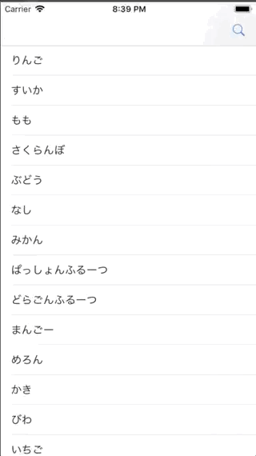

+++
title = "Search the contents of UITableView with UISearchBar(Swift4)"
url = "2018-12-30"
date = "2018-12-30"
description = "Search the contents of UITableView with UISearchBar(Swift4)"
tags = [
  "iOS",
]
categories = [
    "iOS",
]
archives = "2019/01"
aliases = ["migrate-from-jekyl"]
+++

 

#Swift4.2

This is a sample of the combination of UITableView and UISearchBar.
Pressing the magnifying glass on the navigation bar will bring up the SearchBar, and typing a character there will bring up the search results.

Swift3　での記事はこちら

<!-- Google Ads -->


<!-- Amazon Ads -->



