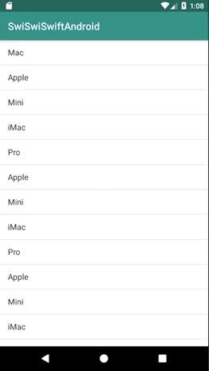

+++
title = "Using ListView to display a list(Kotlin)"
url = "2019-01-08"
date = "2019-01-08"
description = "Using ListView to display a list(Kotlin)"
tags = [
  "Android",
]
categories = [
    "Android",
]
archives = "2019/01"
aliases = ["migrate-from-jekyl"]
+++

 

Use ListView to display the list.
Kotlin and Android are difficult because of the large number of configuration files.

<!-- Google Ads -->


<!-- Amazon Ads -->



