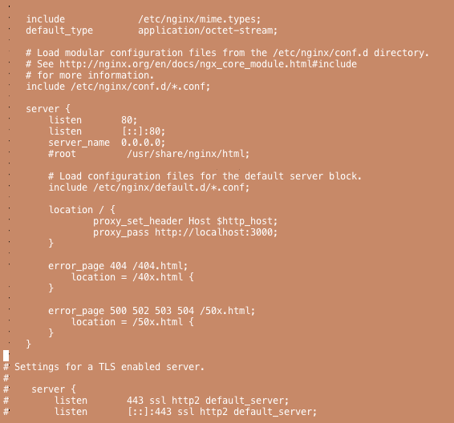

+++
title = "Installing Rails on CentOS7"
url = "2019-01-14"
date = "2019-01-14"
description = "Installing Rails on CentOS7"
tags = [
  "CentOS",
]
categories = [
    "Linux",
    "Ruby",
    "Rails",
]
archives = "2019/01"
aliases = ["migrate-from-jekyl"]
+++

 

This is a note when Rails was installed on CentOS7.  
The final Nginx nginx.conf file can be found here.

<!-- Google Ads -->


<!-- Amazon Ads -->



