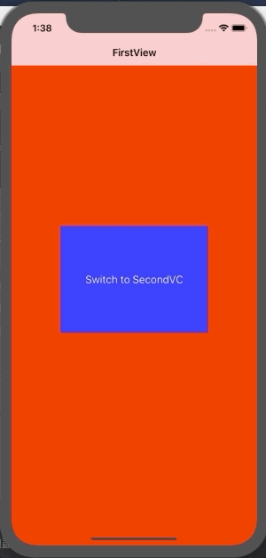

+++
title = "Switching the Root of NavigationController（Swift4.2）"
url = "2019-01-20"
date = "2019-01-20"
description = "Switching the Root of NavigationController（Swift4.2）"
tags = [
    "iOS",
]
categories = [
    "iOS",
    "Swift",
]
archives = "2019/01"
aliases = ["migrate-from-jekyl"]
+++

 
Switching the Root of NavigationController with `setViewControllers`.

<!-- Google Ads -->


<!-- Amazon Ads -->



