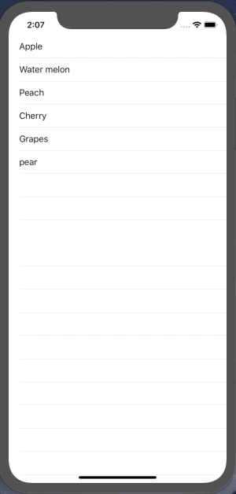

+++
title = "Display items in a table with UITableView（Swift4.2）"
url = "2019-01-22"
date = "2019-01-22"
description = "Display items in a table with UITableView（Swift4.2）"
tags = [
    "iOS",
]
categories = [
    "iOS",
    "Swift",
]
archives = "2019/02"
aliases = ["migrate-from-jekyl"]
+++

 
UITableView is a class that displays text in the form of a list. It is useful for displaying a list of data and so on.

UITableView's class hierarchy

NSObject
↑
UIResponder
↑
UIView
↑
UIScrollView
↑
UITableView

[AppleDeveloperリファレンスUITableView](https://developer.apple.com/documentation/uikit/uitableview)

<!-- Google Ads -->


<!-- Amazon Ads -->



