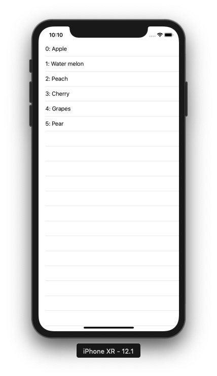

+++
title = "Parse a local Json file and display it in table view (Swift4.2)"
url = "2019-01-27"
date = "2019-01-27"
description = "Parse a local Json file and display it in table view (Swift4.2)"
tags = [
    "iOS",
]
categories = [
    "iOS",
]
archives = "2019/01"
aliases = ["migrate-from-jekyl"]
+++

 

This is a sample code that parses the locally added JSON file and displays it in TableView.  
It would be better to use SwiftyJson or something like that, but this time I wrote it without using it.

<!-- Google Ads -->


<!-- Amazon Ads -->



