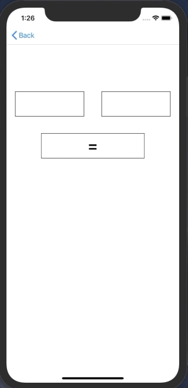
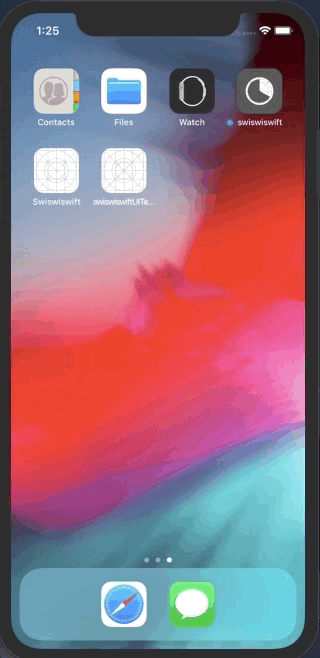

+++
title = "Performing UITest (E2E testing) on iOS (Swift5.0)OSでUITest（E2Eテスト）を行う(Swift5.0)"
url = "2019-04-11"
date = "2019-04-11"
description = "Performing UITest (E2E testing) on iOS (Swift5.0)"
tags = [
    "iOS",
]
categories = [
    "iOS",
]
archives = "2019/04"
aliases = ["migrate-from-jekyl"]
+++

 
This is the sample code to do UITest in Swift.  
I made an app that puts a number in the left and right text fields and calculates the product when you press a button.  

Then I implemented UITest for that app.  

Reference: [【Swift】初めてのUITest導入](https://qiita.com/taji-taji/items/c00e5b94376c37f17443)

<!-- Google Ads -->


<!-- Amazon Ads -->



