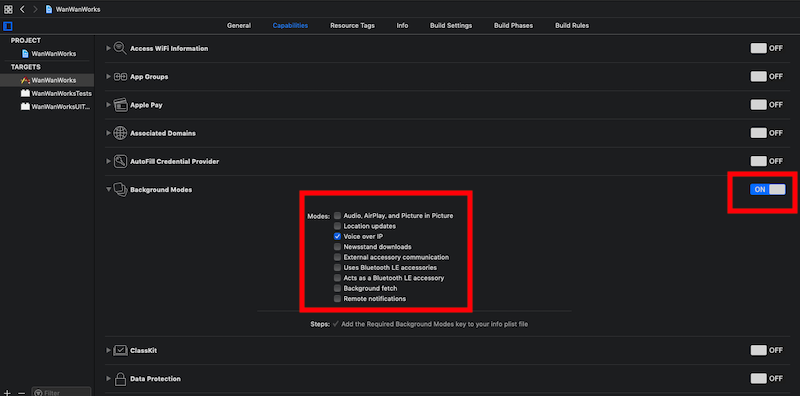
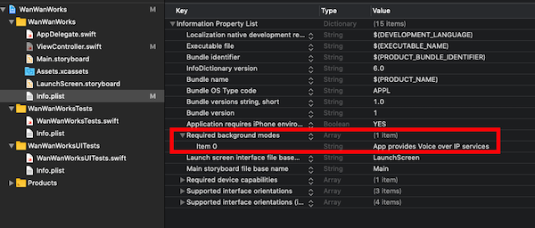

+++
title = "Displaying an incoming call screen using CallKit."
url = "2019-05-12"
date = "2019-05-12"
description = "Displaying an incoming call screen using CallKit."
tags = [
    "iOS",
]
categories = [
    "iOS",
]
archives = "2019/05"
aliases = ["migrate-from-jekyl"]
+++

 

You can use CallKit to use the UI on incoming calls.
I used it to create an app that would call me.

<!-- Google Ads -->


<!-- Amazon Ads -->



